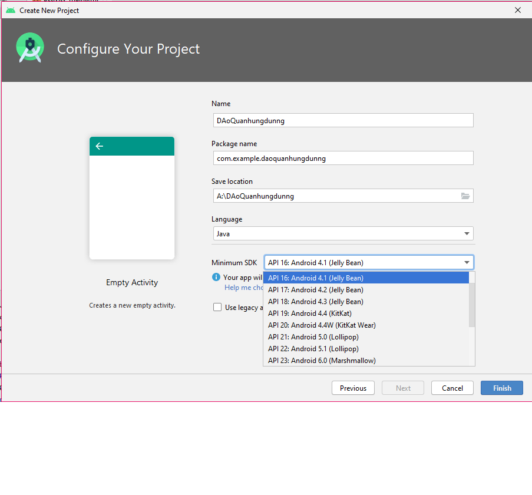
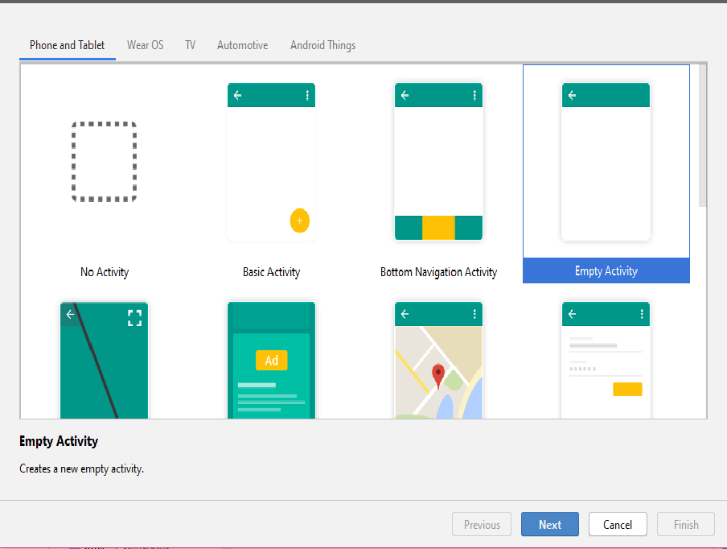
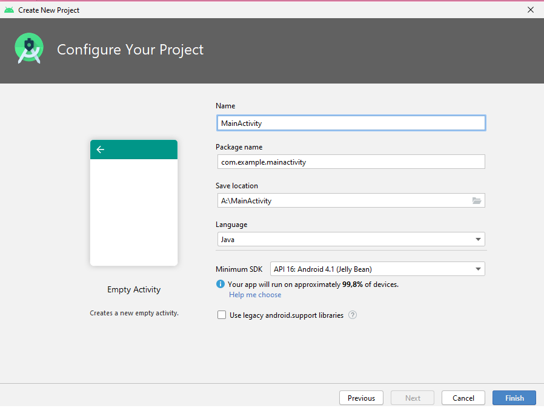
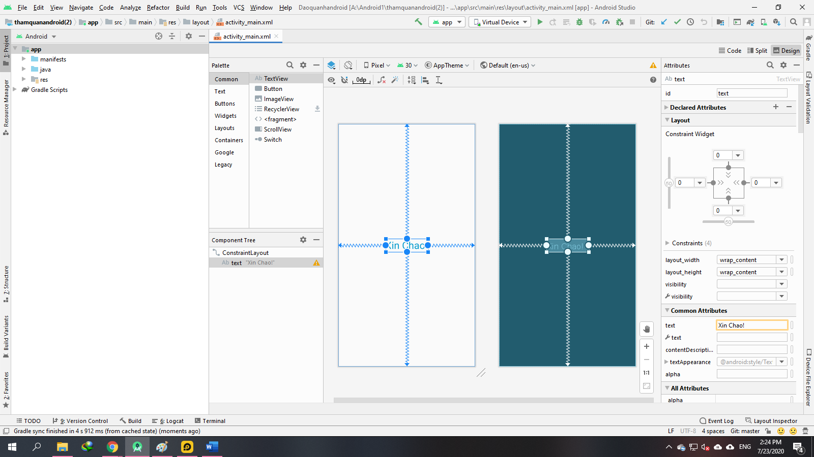

 ### Dạo quanh ứng dụng Android trong Android Studio 4.X
 
 - <a href= "https://ngocminhtran.com/2018/07/11/dao-quanh-ung-dung-android-trong-android-studio-3-x/">Tài Liệu Tham Khảo</a>
 
 - Trong bài viết trước, chúng ta đã cùng tạo ra ứng dụng Android đầu tiên trong môi trường Android Studio 4.X (tức là Android Studio 4.0 trở lên). Trong bài này, chúng ta sẽ tìm hiểu chi tiết hơn về các thành phần liên quan đến một ứng dụng Android trong môi trường Android Studio 4.X.

- Các thành phần cơ bản trong môi trường Android Studio 3.6.1

### Yêu Cầu
A. MÔ TẢ VỀ ỨNG DỤNG Android Studio:
- <a href="https://www.youtube.com/watch?v=sBdbA12rolI&feature=emb_logo">Hướng Dẫn Chi Tiết Hơn</a>

### Tạo một ứng dụng Android mới
- Khi tạo một ứng dụng Android mới, chúng ta sẽ phải điền một số thông tin trong hộp thoại Create Android Project sau:

- Có các Nhiều loại khác nhau mà bạn có thể lựa chọn !

### Tạo một Activity

- Một Activity là một mô-đun ứng dụng liên quan trực tiếp đến một giao diện người dùng và các thành phần của giao diện này như layout, controls, v.v.

- Mặc định, Android Studio 4.X cung cấp một số các Activity mẫu cho phép chúng ta phát triển các ứng dụng Android khác nhau. Chúng ta có thể lựa chọn các mẫu Activity trong hộp thoại Add an Activity to Mobile:
 
 
 
 - Với mục đích của chúng ta, có thể chọn Empty Activity – là một Activity đơn giản nhất. Nhấn Next. Nhập một số thông tin trong hộp Configure Activity:
 
  
  
  
- Activity Name là tên của Activity hiện tại của chúng ta. Lưu ý rằng, một ứng dụng Android có thể có rất nhiều Activity và điều này sẽ được tìm hiểu trong các bài sau. Layout Name là tên của tập tin tạo layout cho giao diện người dùng của Activity hiện tại. Có thể thay đổi tên tùy ý, trong trường hợp này chúng ta giữ nguyên các tên mặc định. Nhận Finish. Giao diện Android Studio lúc này trông như sau:

